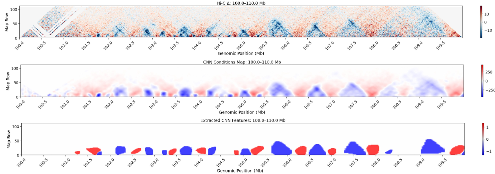

# HiTwinFormer

HiTwinFormer is a workflow for learning robust representations of Hi-C contact maps with Siamese architectures (e.g., LeNet, MaxViT) and using those embeddings to quantify structural similarity across the genome.  
It is an **extension project of Twins** (https://www.nature.com/articles/s41467-023-40547-9), designed to test **different loss functions, backbones, and augmentation strategies** for Hi-C representation learning.

## Workflow

1. **Create conda environment**

Create conda environment with environment.yml file using: conda env create -f environment.yml

2. **Create mlhic dataset**

Create mlhic data with `generate_mlhic.py` script (Need to tile along the diagonal and quality-control Hi-C data before feeding into model). This stores all the relevant files and groups them by experimental condition inside a json dictionary that is used throughout the rest of the pipeline.

3. **Train models**

Run `main-v3_with_supcon.py` to generate model. I recommend doing pairwise loss with 0 augmentations and varying batch sizes using both LeNet and MaxViT. Note this requires wandb for training - I highly recommend using it - will remove the requirement soon.

Example bash script:

python main-v3_with_supcon.py SLeNet CTCF_224.json 0.001 control KO --mask True --outpath /home/tt920/HiTwinFormer/model_outputs/ --epoch_enforced_training 10 --batch_size 32 --loss contrastive --n_aug 0 --experiment_name D4_CTCF_new --patience 3

4. **Extract features**

Run `make_feature_maps.py` to make differential cnn feature maps

Example bash script: 

python make_feature_map.py \
    --model_name SLeNet \
    --model_file /home/tt920/HiTwinFormer/model_outputs/SLeNet_D4_CTCF_new_0.01_128_triplet_30004_0_aug.ckpt \
    --save_path /home/tt920/HiTwinFormer/feature_maps/ctcf_npc_features_triplet_0_aug.fmlhic \
    --reference_genome mm10 \
    --json_file ctcf_224.json

5. **Calculate embedding distances**

Run `distance_calculation_all_stats_original_version_middle.py` to generate csv's with embedding distances to simplify downstream analysis.

Example bash script: 

python distance_calculation_all_stats_original_version_middle.py \
  --mlhic_dataset_path ctcf_224.json \
  --model_ckpt_dir model_outputs/ctcf_final/maxvit_multi/contrastive/ \
  --output_dir distances/ctcf/ \
  --model_name SMaxVit \
  --reference_genome mm10 \
  --bin_size 10000 \
  --patch_len 224 

5. **Analyse results**

Now, you are ready to look at the results of the model with `Example_analysis.ipynb`

Below are some of the example analysis outputs:

