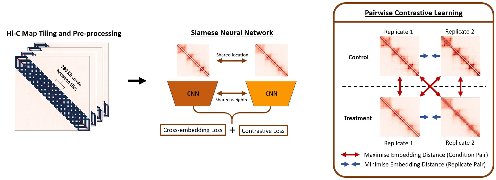
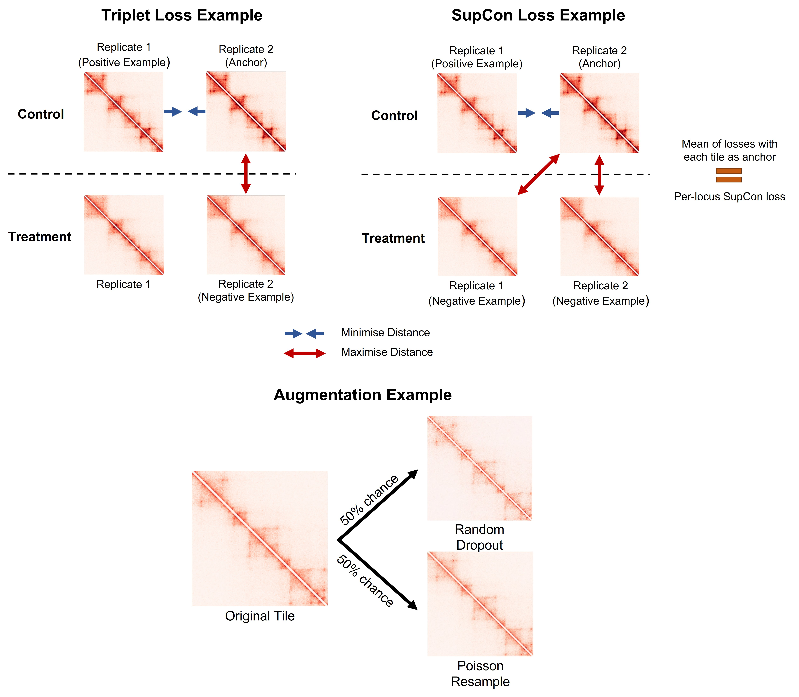
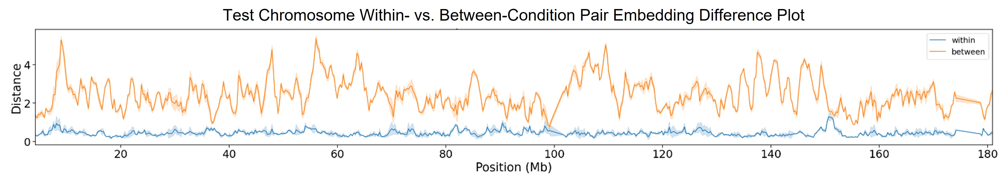
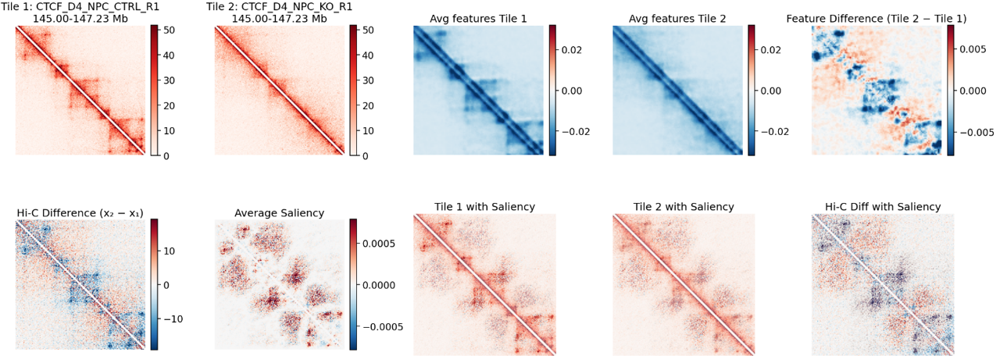
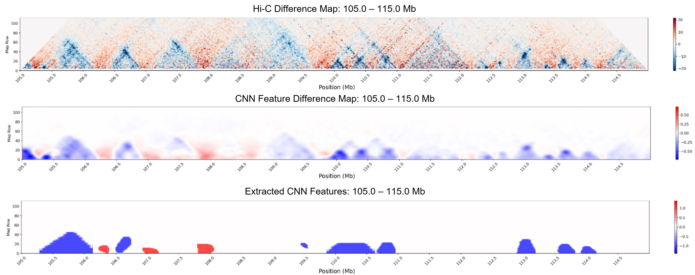

# HiTwinFormer

HiTwinFormer is a workflow for learning robust representations of Hi-C contact maps with Siamese architectures (e.g., LeNet, MaxViT). It uses these embeddings to quantify structural changes across the genome that occur between different experimental conditions.  

This is an **extension project of [Twins](https://www.nature.com/articles/s41467-023-40547-9)**, designed to test **different loss functions, backbones, and augmentation strategies** for Hi-C representation learning.

---

## Background

The premise of Twins is **contrastive learning**, where:

- Embedding distances between **replicates** (same condition) are minimized.  
- Embedding distances between **different conditions** are maximized.  

In this way, the model learns to distinguish **technical/biological noise within conditions** from **true structural changes between conditions**.

Each Hi-C map is partitioned into overlapping **224 × 224 bin tiles** along the diagonal. These pre-processed `.mlhic` files are combined into a **pairwise dataset** where all unique tile pairings from the same genomic location are created and labeled as *same condition* or *different condition*.  

A Siamese CNN is then trained with:  
- A **pairwise contrastive loss**, and  
- A **cross-embedding classifier loss**, which encourages better convergence by predicting whether a tile pair is a replicate or condition pair based on embedding distance.
  
Twins Workflow Overview:


### Extensions tested
- **Triplet loss** and **SupCon loss**: did not improve performance (SupCon was worse).  
- **Poisson resampling / random dropout augmentations**: no performance gain.  
- **Backbone change to MaxViT (transformer)**: best improvement, with models focusing on clearer structural features than CNNs.

Twins Extensions Overview:


---

## Workflow

1. **Create Conda Environment**
In the command line create the conda environment from the provided `environment.yml` file:

```bash
conda env create -f environment.yml
```

2. **Create mlhic dataset**

* Requires ≥2 replicates for both control and treatment conditions.  
* Tiles are extracted (224 × 224 bins, overlapping along the diagonal).  
* Tiles undergo QC to remove those with excessive empty rows/columns.  
* Run and edit `generate_mlhic.py` on your dataset.

This script outputs a JSON dictionary grouping processed files by experimental condition.  
Currently only supports `.hic` input (not `.cool`).

3. **Train models**

Train with `main_final.py`.

Recommendations:

- Start with **pairwise contrastive loss** and **0 augmentations**.  
- Try multiple batch sizes (4, 8, 16, 32, 64, 128).  
- Use both **LeNet** (lighter, CNN) and **MaxViT** (transformer, requires ≥24 GB VRAM). Note **MaxViT** models are incapable of producing differential feature maps.
- Enable `--use_wandb` to better monitor training runs.  

`twins.sh` is a bash script example that will train models across all the loss functions and batch sizes tested in the project.
The diagonal of each tile is masked during training so the model focuses on off-diagonal structural features. The current mask covers the diagonal bin and two bins on each side, such that 50 kb of interactions are removed in our current 10 kb resolution setup. 

Example command line script:

```bash
python main_final.py SLeNet CTCF_224.json 0.001 control KO --mask True --outpath /home/tt920/HiTwinFormer/model_outputs/ --epoch_enforced_training 10 --batch_size 32 --loss contrastive --n_aug 0 --experiment_name D4_CTCF_new --patience 3 --optimiser Adam --use_wandb
```

4. **Extract features**

Run `make_feature_maps.py` to make differential CNN feature maps. This can run on either GPU or CPU - if calculating saliencies genome-wide, we recommend using a GPU. `feature_map_gpu.sh` is an example bash script.

Example command line script: 

```bash
python make_feature_map.py --model_name SLeNet --model_file /home/tt920/HiTwinFormer/model_outputs/SLeNet_D4_CTCF_new_0.01_128_contrastive_30004_Adam_0_aug.ckpt --save_path /home/tt920/HiTwinFormer/feature_maps/ctcf_npc_features_contrastive_0_aug.fmlhic --reference_genome mm10 --json_file ctcf_224.json 
```

5. **Calculate embedding distances**

You can run it on:  
- One model checkpoint → use `--mlhic_dataset_path`  
- A directory of checkpoints → use `--model_ckpt_dir` 

Example command line script: 

```bash
python distance_calculation.py --mlhic_dataset_path D4_CTCF_224.json --model_ckpt_dir model_outputs/ctcf_final/maxvit_multi/contrastive/ --output_dir distances/ctcf/ --model_name SMaxVit --reference_genome mm10 --bin_size 10000 --patch_len 224 
```
5. **Analyse results**

Now, you are ready to look at the results of the model with `Example_analysis.ipynb`

Below are some of the example analysis outputs:

Example Embedding Distance Plot:



Example Feature Visualisation and Saliency Mapping:



Feature Extraction Example:



